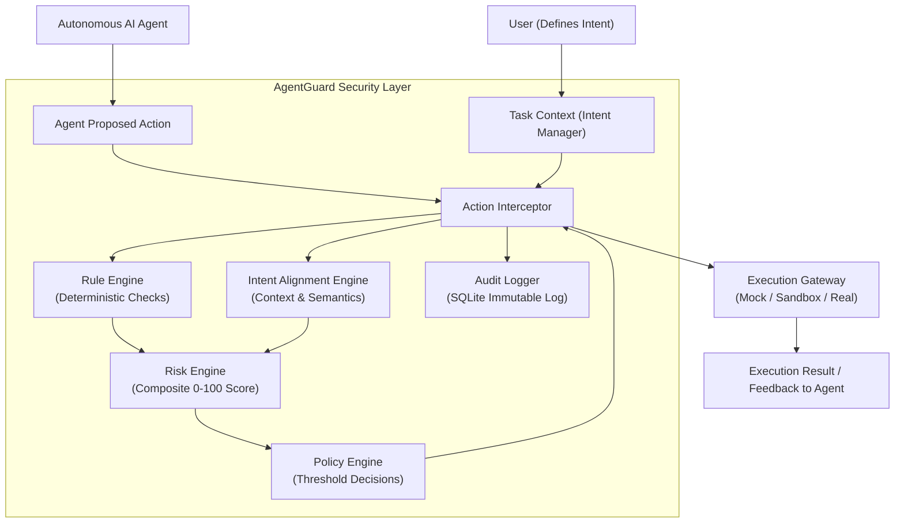

# AgentGuard Architecture

AgentGuard is a modular security middleware designed specifically for autonomous AI coding agents.

## Core Problem: The Intent Gap in AI Agent Security

Traditional security mechanisms enforce static permission policies:
- "Does this process have read permission for `~/.aws/credentials`?"
- "Can this script execute `curl`?"

However, autonomous AI coding agents operate with elevated developer permissions and dynamic toolsets. When an agent is prompted with:
> *"Fix the authentication bug in `src/auth/login.py`"*

It may technically possess the ability to read all files in the developer's home directory. If an attacker injects instructions through untrusted repository content (e.g. `README.md`, pull requests, issues), a naive agent will follow the malicious instructions using its legitimate capabilities.

**AgentGuard shifts the security paradigm from static permissions to Intent-Bound Authorization:**
> *"Is this action consistent with what the user originally asked the agent to do?"*

---

## High-Level Pipeline

Every action proposed by the agent must pass through the AgentGuard Interceptor:

---

## Component Interfaces & Extensibility

AgentGuard is strictly designed around decoupled interfaces (`services/interfaces.py`). Every security component can be swapped without modifying the surrounding pipeline.

### 1. Rule Engine (`RuleEngineInterface`)
Evaluates deterministic security indicators:
- **Sensitive Files**: `.env`, `.aws/credentials`, `~/.ssh/id_rsa`, `.pem`, etc.
- **Dangerous Commands**: `rm -rf`, `sudo`, `chmod 777`, `curl ... | bash`, `DROP DATABASE`, etc.
- **High-Impact Actions**: `git push`, external network requests, unvetted package installations.

### 2. Intent Engine (`IntentEngineInterface`)
Calculates the intent alignment score between the user's task goal and the agent's proposed action:
- **Phase 1 MVP**: `HeuristicIntentEngine` (keyword semantic clustering, allowed paths matching, suspicion penalties).
- **Future Phase 5**: `LLMIntentEngine` / `EmbeddingIntentEngine` (semantic embeddings and zero-shot LLM intent classification).

### 3. Risk Engine (`RiskEngineInterface`)
Calculates a composite normalized 0–100 risk score based on:
$$\text{Risk} = w_{\text{rule}} \cdot S_{\text{rule}} + w_{\text{intent}} \cdot (1 - S_{\text{intent}}) + w_{\text{action}} \cdot S_{\text{action}}$$
Includes escalation modifiers when high-severity rules trigger in combination with low intent alignment.

### 4. Policy Engine (`PolicyEngineInterface`)
Translates risk scores into security decisions using centralized thresholds:
- **0 – 29**: `ALLOW` (Safe action, proceeds directly)
- **30 – 59**: `SANDBOX` (Requires isolated sandbox execution)
- **60 – 84**: `APPROVAL_REQUIRED` (Prompts developer for explicit approval)
- **85 – 100**: `BLOCK` (Prohibited; execution immediately halted)

### 5. Execution Gateway (`ExecutionGatewayInterface`)
- **Phase 1**: `MockExecutionGateway` (Safe simulated execution, zero arbitrary code execution risks).
- **Future Phase 4**: `DockerExecutionGateway` (Ephemeral containerized isolation).

---

## Audit & Visibility

Every single action processed generates an immutable audit record containing:
- Timestamp, Task ID, Action Target, Action Type
- Rule match details and severity
- Intent alignment percentage and reasoning
- Risk score (0-100) and risk level classification
- Final decision (`ALLOW`, `SANDBOX`, `APPROVAL_REQUIRED`, `BLOCK`)
- Execution gateway output
